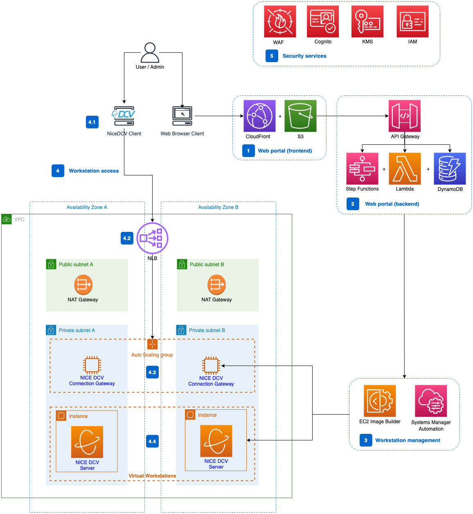
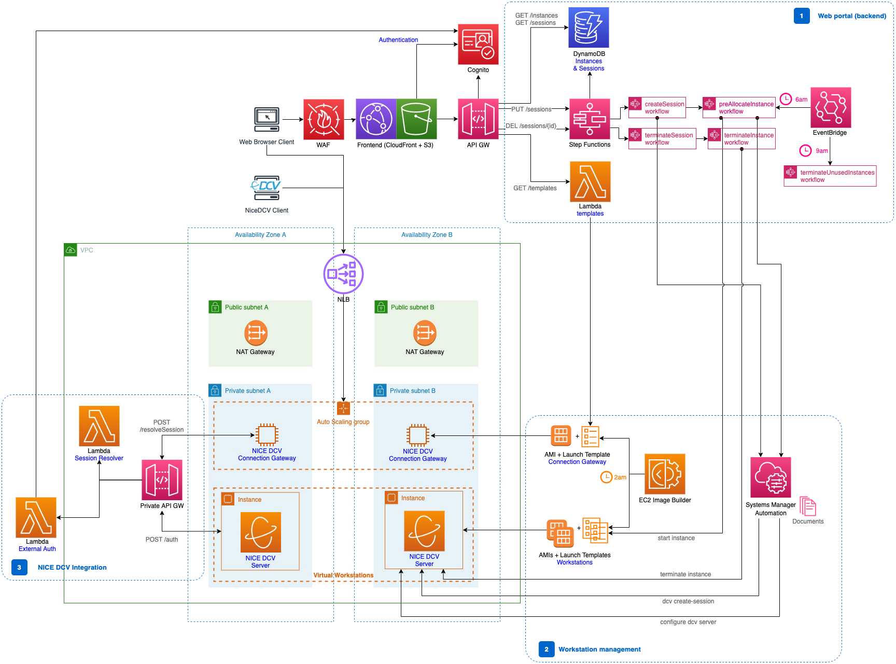

> :warning: If you are looking for a VDI solution based on DCV, we strongly recommend to go with _[Research and Engineering Studio on AWS](https://aws.amazon.com/hpc/res/)_, which is a solution officially maintained and supported by AWS, and providing much more features than this sample (SAML, persistence of the workstations, file sharing, ...). 

# Customisable DCV-based VDI Solution

Current version: **0.2.0**

## 📋 Table of content

- [Description](#-description)
- [Main Features](#-main-features)
- [Benefits](#-benefits)
- [Architecture](#-architecture)
- [Requirements](#-requirements)
- [Deployment](#-deployment)
- [Usage](#-usage)
- [Cleanup](#-cleanup)
- [Troubleshooting](#-troubleshooting)
- [Detailed Architecture](#-detailed-architecture)
- [See Also](#-see-also)

## 🔰 Description

The solution leverages the NICE DCV protocol to provide a secure and customizable Virtual Desktop Infrastructure (VDI) deployable in a VPC on an AWS account.

This solution also includes a simple and intuitive web portal, that allows users to access their workstation and administrators to provision new workstations and create new sessions.

## 🧩 Main Features

 - Virtual Desktop Infrastructure (VDI) / Remote Desktop solution based on [NICE DCV](https://aws.amazon.com/hpc/dcv/) server and [NICE DCV Connection Gateway](https://docs.aws.amazon.com/dcv/latest/gw-admin/what-is-gw.html).
 - Workstation images customization and automation.
 - Web portal for users to easily start and access their workstations.

## ☑️ Benefits

Compared to other alternatives, this solution provides:

- Enhanced security at different levels: data encryption at rest (with KMS customer managed keys) and in transit, private subnets, traceability and auditability, image updates...).
- Improved streaming performance (using NICE DCV instead of PCoIP), to support very demanding 3D graphical applications.
- More flexibility, with the ability to quickly spin up and shut down projects (new workstation images).
- Automated processes for deployments (with Terraform) and workstation images build and deployment.
- Web access (no AWS console need) for users and admins.

## ⚙️ Architecture

Below is the architecture diagram describing the solution infrastructure



1. The web portal is deployed as a single page application, developed in React, deployed on [Amazon S3](https://aws.amazon.com/s3/) and exposed/cached by an [Amazon CloudFront](https://aws.amazon.com/cloudfront/) distribution.
2. The portal backend is built with [AWS Step Functions](https://aws.amazon.com/step-functions/), [AWS Lambda](https://aws.amazon.com/lambda/), [Amazon DynamoDB](https://aws.amazon.com/dynamodb/) and exposed to the frontend as a REST API with [Amazon API Gateway](https://aws.amazon.com/api-gateway).
3. [EC2 Image Builder](https://aws.amazon.com/image-builder/) is used to create workstation and connection gateway images (AMIs & Launch Templates) together with [AWS Systems Manager](https://aws.amazon.com/systems-manager/) automation which prepares the EC2 instances used for the workstations.
4. For users to connect to workstations:
   1. They leverage the NICE DCV client (available for multiple OS, to [download here](https://download.nice-dcv.com/))
   2. The [Network load balancer (NLB)](https://aws.amazon.com/elasticloadbalancing/network-load-balancer/) load balances the TCP or UDP traffic from the users to a dynamically scalable fleet of connection gateways.
   3. The [NICE DCV Connection Gateway](https://docs.aws.amazon.com/dcv/latest/gw-admin/what-is-gw.html) fleet is based on [Amazon EC2 instances](https://aws.amazon.com/ec2) and can scale up and down with an autoscaling group.
   4. Workstations are also based on EC2 instances and contains the [NICE DCV Server](https://docs.aws.amazon.com/dcv/latest/adminguide/servers.html) software.
5. The solution leverage several security services such as [Amazon Cognito](https://aws.amazon.com/cognito/) for the authentication on the frontend, [AWS WAF](https://aws.amazon.com/waf/) (Web Application Firewall) to protect the frontend (IP allow list), [AWS KMS](https://aws.amazon.com/kms/) to encrypt data at rest and obviously [AWS Identity and Access Management(IAM)](https://aws.amazon.com/iam/) to manage permissions. Note that if required by your company, you may need to perform additional penetration tests on the web portal.

You can get more information in the [Detailed architecture](#-detailed-architecture).

## 🎒 Requirements

- An AWS Account must be available and the deployment machine must be able to deploy on this account. ([How to create an AWS account](https://aws.amazon.com/premiumsupport/knowledge-center/create-and-activate-aws-account/?nc1=h_ls) | [AWS Command Line Interface](https://aws.amazon.com/cli/))
- The user or role deploying the solution must have the following policies:
   - `PowerUserAccess`
   - `IAMFullAccess`
- [Terraform v.1.2.2+](https://www.terraform.io/) must be installed on the deployment machine to deploy the infrastructure ([Instructions](https://www.terraform.io/cli)).
- [Node.js v16+](https://nodejs.org/en/download/) must be installed on the deployment machine to build the web portal ([Instructions](https://docs.npmjs.com/downloading-and-installing-node-js-and-npm)).
- [Python 3.9+ and pip](https://www.python.org/downloads/) must be installed on the deployment machine to build the Lambda functions.

_Note_: If you do not use the `deploy.sh` script during [deployment](#-deployment), please make sure to run the [prerequisites.sh](./terraform/prerequisites.sh) script prior to start the deployment.

### Networking

The solution comes with an out-of-the-box VPC that includes 2 public and 2 private subnets.

The whole networking set up is defined in the [Networking](./terraform/modules/networking) module.
If you want to deploy the solution within an existing network setting you can remove the [Networking](./terraform/modules/networking) module folder and make sure that all [exported values ](./terraform/modules/networking/outputs.tf) are replaced with your network settings and made available to the other modules.

⚠️ __The solution assumes the usage of 2 private and 2 public subnets. If your network settings differ you might need to review where subnets are used in other modules and ensure your settings are compatible or adjust the code__

Required values are:
- `vpc_id` - The VPC ID
- `vpc_cidr` - The VPC CIDR
- `private_subnets` - List of private [aws_subnet](https://registry.terraform.io/providers/hashicorp/aws/latest/docs/resources/subnet) resources
- `private_subnets_ids` - List of private subnets ID `list(string)`
- `public_subnets` - List of public [aws_subnet](https://registry.terraform.io/providers/hashicorp/aws/latest/docs/resources/subnet) resources
- `public_subnets_ids` - List of public subnets ID `list(string)`
- `api_gateway_vpc_endpoint_id` - [VPC Endpoint ID](https://registry.terraform.io/providers/hashicorp/aws/latest/docs/resources/vpc_endpoint#id) for API gateway, required to ensure DCV gateway APIs are private.


### Golden Images

The solution implements an EC2 image generation and configuration pipeline using [EC2 Image Builder](https://aws.amazon.com/en/image-builder/) and [AWS Systems Manager](https://aws.amazon.com/systems-manager/?nc1=h_ls).

There are 2 main golden images used in this solution:
- The [NICE DCV Connection Gateway](https://docs.aws.amazon.com/dcv/latest/gw-admin/what-is-gw.html) image - this one is used in the connection gateway behind the NLB.
- The [NICE DCV Server](https://docs.aws.amazon.com/dcv/latest/adminguide/servers.html) image - this one is used for the workstation.

The solution includes:
- an EC2 Image Builder pipeline to generate the NICE DCV Connection Gateway image located under [terraform/modules/connection-gateway/preset-images](./terraform/modules/connection-gateway/preset-images)
- an EC2 Image Builder pipeline to generate the NICE DCV Server image located under [terraform/modules/vdi/preset-images](./terraform/modules/vdi/preset-images). One Linux and one Windows image example are provided.

All pipelines retrieve the NICE DCV components (Server or Connection Gateway) on [https://download.nice-dcv.com/](https://download.nice-dcv.com/). If you prefer, you can download them manually and put them in S3: Update [components.tf](./terraform/modules/connection-gateway/preset-images/amazon-linux-2/component.tf) for the connection gateway and [linux nice-dcv-component.tf](./terraform/modules/vdi/preset-images/amazon-linux-2/nice-dcv-component.tf) / [windows nice-dcv-component.tf](./terraform/modules/vdi/preset-images/windows-server-2022/nice-dcv-component.tf) for the server.

You can change the base AMI in [terraform/variables.tf](./terraform/variables.tf) (`connection_gateway_base_image` and `workstation_base_images`), or you can even remove the image generation and replace the [EC2 Launch templates](https://docs.aws.amazon.com/autoscaling/ec2/userguide/launch-templates.html#:~:text=A%20launch%20template%20is%20similar,used%20to%20launch%20EC2%20instances) with your AMIs.

## 🚀 Deployment

Before getting started, verify that you went through the [list of requirements](#-requirements). Once you do so you can deploy the stack

### variables.tf
Make sure all values inside [./terraform/variables.tf](terraform/variables.tf) are filled up with your desired values

_Notes:_
- `ip_allow_list`: the web portal is protected by a WAF and is only accessible from a set of allowed IPs (typically your company CIDR).
- `workstation_base_images` & `connection_gateway_base_image`: when using AMIs, the image must be available in the specified region (`region`). Look into the EC2 console / [AMIs section](https://console.aws.amazon.com/ec2/home#Images:visibility=public-images;v=3;$case=tags:false%5C,client:false;$regex=tags:false%5C,client:false). Default values were provided at a given time, and AMIs may have evolved since that time: you should always use the most up-to-date version.

⚠️ __Attention__ ⚠️: This solution is deployed with `terraform`, not AWS Cloudformation or AWS CDK and thus when an error occurs, it does not rollback the deployment. You either need to fix the issue and continue the deployment in the same folder (as terraform keeps the state in a _terraform.tfstate_ file), or use `terraform destroy` to clean things up before retrying. Otherwise, you may end up with errors about duplicate resources, or already existing resources.

### All-in-one deployment (option 1)
You can deploy the solution with the [deploy.sh](./terraform/deploy.sh) script available in the terraform folder. Ensure the script is executable (`chmod +x deploy.sh`) and type:
```bash
./deploy.sh
```
It will first try to connect to your account and will ask for confirmation. It will then deploy the whole infrastructure and the web portal.

| Metric              | Value         |
|---------------------|---------------|
| **Deployment Time** | 20-30 minutes |

### Step-by-step deployment (option 2)

First, if you didn't already, run the [prerequisites.sh](./terraform/prerequisites.sh) script to check that everything is properly configured before starting the deployment.

#### Infrastructure (terraform)
You first need to initialize the project:
```bash
$ terraform init
```

Check what is about to be deployed with:
```bash
$ terraform plan
```

Deploy the stack:
```bash
$ terraform apply
```

#### Web portal
- The web portal is a single page application, built in [React](https://reactjs.org/) framework and [CRACO](https://github.com/gsoft-inc/craco) and written in TypeScript language. 
- It is deployed as a set of static assets in S3, exposed by a CloudFront distribution.

To facilitate frequent changes deployments, a [web-portal/deploy.sh](./web-portal/deploy.sh) command is provided (different from the one in terraform folder).

If you do some modifications to the web portal, run the following command. 
Please make sure to replace _frontend_bucket_ and _frontend_distribution_id_ with the appropriate values (you can get them in the outputs from terraform, running `terraform output` in the terraform folder).
```bash
$ ./deploy.sh -s frontend_bucket -d frontend_distribution_id
```

## 📌 Usage

### ⚠️ Before starting

Before starting any session from the web portal, please make sure all the images are properly built in EC2 Image Builder. 
You can use the following command (make sure to replace the REGION, ACCOUNT, PROJECT and ENVIRONMENT with the proper values):

```shell
aws imagebuilder get-image --image-build-version-arn arn:aws:imagebuilder:REGION:ACCOUNT:image/PROJECT-ENVIRONMENT-connection-gateway/1.0.0/1 --query '[image.state.status, image.outputResources.amis[0].image]'
#exemple: aws imagebuilder get-image --image-build-version-arn arn:aws:imagebuilder:eu-west-1:1234567890:image/dcv-portal-dev-connection-gateway/1.0.0/1 --query '[image.state.status, image.outputResources.amis[0].image]'
```

You should get something like:
```
[
    "AVAILABLE",
    "ami-06e24532059165874"
]
```

Also verify the running connection gateway (called "[NICE DCV] Connection Gateway") is running with the good AMI. Use the following command (make sure to replace `IMAGE_ID` with the ami previously retrieved):

```shell
aws ec2 describe-instances --filters "Name=tag:Name,Values='[NICE DCV] Connection Gateway'" "Name=image-id,Values=IMAGE_ID" "Name=instance-state-name,Values=running"
```

Verify Linux and Windows images are also ready (they should be marked as `AVAILABLE`):
```shell
aws imagebuilder get-image --image-build-version-arn arn:aws:imagebuilder:REGION:ACCOUNT:image/PROJECT-ENVIRONMENT-amazon-linux-2-vdi/1.0.0/1 --query '[image.state.status, image.outputResources.amis[0].image]'
aws imagebuilder get-image --image-build-version-arn arn:aws:imagebuilder:REGION:ACCOUNT:image/PROJECT-ENVIRONMENT-windows-2022-vdi/1.0.0/1 --query '[image.state.status, image.outputResources.amis[0].image]'
```


### User management

This sample comes with Cognito to authenticate users on the web portal. You must create the users in Cognito, so they can connect to the frontend.

Once the administrator create a user in Cognito, it also automatically create a password in AWS Secrets Manager (`dcv-<username>-credentials`).

This password will be needed by the user to connect to the workstation. **Note that this password is different from the Cognito one**.

When creating DCV sessions, a user is created for the instance with the password found in Secrets Manager.

In order to create an Admin user, you must add the Cognito user to the Cognito group 'admin'.

In a production environment, you should use a directory (eg. AD or equivalent) to connect to the instances.


### Creating / Changing the templates for the workstations

In this sample, two templates are provided. One is based on Windows Server 2022 and can be found in [_terraform/modules/vdi/preset-images/windows-server-2022_](terraform/modules/vdi/preset-images/windows-server-2022). The other is based on Amazon Linux 2 and can be found in [_terraform/modules/vdi/preset-images/amazon-linux-2_](terraform/modules/vdi/preset-images/amazon-linux-2). 
The images will be built with EC2 Image Builder, based on the [recipe](https://docs.aws.amazon.com/imagebuilder/latest/userguide/manage-recipes.html) that you can find in [image-recipe.tf](terraform/modules/vdi/preset-images/windows-server-2022/image-recipe.tf) (Windows) or [image-recipe.tf](terraform/modules/vdi/preset-images/amazon-linux-2/image-recipe.tf) (Linux).
Within these files, you can add other [components](https://docs.aws.amazon.com/imagebuilder/latest/userguide/manage-components.html).
You can find samples of custom components in [nice-dcv-component.tf](terraform/modules/vdi/preset-images/windows-server-2022/nice-dcv-component.tf) (Windows), [nice-dcv-component.tf](terraform/modules/vdi/preset-images/amazon-linux-2/nice-dcv-component.tf) (Linux) and [vdi-component.tf](terraform/modules/vdi/preset-images/windows-server-2022/vdi-component.tf)(Windows), [vdi-component.tf](terraform/modules/vdi/preset-images/amazon-linux-2/vdi-component.tf) (Linux), or use pre-built AWS components that you can find in the [console](https://console.aws.amazon.com/imagebuilder/home#/components).

After updating the Terraform template, use `terraform apply` to deploy the changes on the AWS Account. After the deployment, a Lambda function is triggered to launch the Image Builder pipeline to generate the image. You will need to wait for 10-15 minutes to have the Image / Launch Template ready.

### Configure / Remove the pre-allocation of instances

Each day of the week (Monday-Friday), some instances are pre-allocated, so that users can get a workstation quicker when they start working.

You can disable this if you don't need it or change the schedule in [terraform/modules/vdi/sfn-create-instances.tf](./terraform/modules/vdi/sfn-create-instances.tf):

```terraform
resource "aws_cloudwatch_event_rule" "step_function_event_rule" {
name                = "${var.project}-${var.environment}-preallocate-instance-rule"
schedule_expression = "cron(0 5 ? * 2-6 *)"
description         = "Rule to trigger instance pre allocation automatically every morning"
}
```

When instances are not used later in the morning, they are automatically shut down. You can change this in [terraform/modules/vdi/sfn-terminate-unused-instances.tf](./terraform/modules/vdi/sfn-terminate-unused-instances.tf):

```terraform
resource "aws_cloudwatch_event_rule" "invoke_terminate_unused_instances_event_rule" {
name                = "${var.project}-${var.environment}-terminate-unused-instances"
schedule_expression = "cron(0 8 ? * 2-6 *)"
description         = "Rule to trigger destruction of unused instances at 10pm in the morning"
}
```
Schedules use UTC+0 time zone. [More information on EventBridge schedule rules](https://docs.aws.amazon.com/eventbridge/latest/userguide/eb-create-rule-schedule.html).

### Web portal
See [Web portal README](web-portal/README.md#-usage).

## 🧹 Cleanup

Whenever you need to remove the solution and all the resources it has deployed on the account, apply the following instructions:

- First terminate all workstation instances (can be done either from the web portal as an administrator or via the AWS Console).
- Then run the following commands:
  ```bash
  $ aws elbv2 modify-load-balancer-attributes --load-balancer-arn <NLB_ARN> --attributes Key=deletion_protection.enabled,Value=false
  $ terraform destroy
  ```
  - First command permits to remove the deletion protection on the Load Balancer. You can get the <NLB_ARN> in the Terraform outputs (`network_load_balancer`). You can also change this parameter in the [EC2 console](https://console.aws.amazon.com/ec2/home#LoadBalancers) (_Actions / Edit load balancer attributes / Deletion protection_).
  - Second command destroy the whole solution using terraform.

| Metric           | Value         |
|------------------|---------------|
| **Cleanup Time** | 20-30 minutes |


## 🛠 Troubleshooting
### Errors during deployment (terraform apply)
You may encounter errors during the deployment, when performing `terraform apply` (or with the _deploy.sh_ script).

#### API Gateway 
If you have such an error:

```terraform
error updating API Gateway Stage (ags-4dj3pc3f5g-prod): BadRequestException: CloudWatch Logs role ARN must be set in account settings to enable logging
```

In that case, you need to configure a role for API Gateway to access CloudWatch Logs. See this [article](https://aws.amazon.com/premiumsupport/knowledge-center/api-gateway-cloudwatch-logs/?nc1=h_ls).

#### Instance refresh

If you have such an error:
```terraform
╷
│ Error: updating Auto Scaling Group (workspaces-dev-connection-gateway): ValidationError: An active instance refresh with a desired configuration exists. All configuration options derived from the desired configuration are not available for update while the instance refresh is active.
│       status code: 400, request id: c0dbb74d-82b6-4a6f-a7d5-5c3cb4b4629e
│
│   with module.connection_gateway.aws_autoscaling_group.connection_gateway_asg,
│   on modules/connection-gateway/connection-gateway.tf line 122, in resource "aws_autoscaling_group" "connection_gateway_asg":
│  122: resource "aws_autoscaling_group" "connection_gateway_asg" {
│
╵
```
It means you try to redeploy the solution while the Connection Gateway Autoscaling Group is currently refreshed with the latest version of the image. 
You can get the status of the refresh in the EC2 console (under Auto Scaling Groups at the bottom of the left menu) or with the CLI and the following command:

```shell
aws autoscaling describe-instance-refreshes --auto-scaling-group-name <projectname>-<envname>-connection-gateway
```
Replace `<projectname>` and `<envname>` with the values you specified in the variables.tf (project and environment variables).

You can wait for the refresh to complete or you can cancel the refresh with the `cancel-instance-refresh` command:
```shell
aws autoscaling cancel-instance-refresh --auto-scaling-group-name <projectname>-<envname>-connection-gateway
```

### Unable to connect to the workstation
If the NICE DCV Client returns an error when trying to connect to a workstation, it may be because of the connection gateway.
- First verify there are some instances available and healthy in the Target Groups. You should see at least one instance with the name _[NICE DCV] Connection Gateway_
- If this is not the case, make sure the Auto Scaling Group has 1 (or more) as desired/minimum capacity.
- If there are some instances, connect to them via the _Connect_ button (and Session Manager) in the EC2 console.
- Then type the following commands:
  - `sudo su -`
  - `systemctl status dcv-connection-gateway`. It should return a status `active`.
- If the status is `inactive`, type the following command:
  - `systemctl restart dcv-connection-gateway`
- You can further analyze the issue with the logs available in `/var/log/dcv-connection-gateway/gateway.log`

It may also be due to the expired authentication. If the user is connected since a long time on the portal, (s)he may need to refresh the page and get a new connection file / connection string. This is because the Auth token expired and is not valid anymore.

### Blank screen
If the web portal is a blank page, it's certainly due to the WAF, blocking the access. Your IP address may not be in the allow list. Make sure to configure the allow-list properly in the [variables.tf](./terraform/variables.tf).

### Have another issue?
Feel free to create a GitHub issue.


## ⚙️ Detailed architecture
The following diagram gives some details on the architecture:



1. The backend is essentially made up of:
   - A [DynamoDB](https://aws.amazon.com/dynamodb/) table that stores the instances (pre-allocated EC2 instances, not assigned to any user) and sessions (instances associated to users).
   - [Step Functions](https://aws.amazon.com/step-functions/) workflows that handles the different processes:
     - Provisioning (`preAllocateInstance`) and terminating (`terminateInstance`) instances.
     - Creating (`createSession`) and terminating (`terminateSession`) the sessions.
   - [Lambda](https://aws.amazon.com/lambda/) is used to handle templates (Launch Templates). This is an administrator feature which permits to see the different templates available and their versions, set one as the default, start instances based on these templates...
   - [EventBridge](https://aws.amazon.com/eventbridge) rules (scheduled) that will automatically allocate instances early in the morning and stop unused ones later (`terminateUnusedInstances` workflow), so that when users require an instance, they get it faster. 
2. [Systems Manager Automation](https://docs.aws.amazon.com/systems-manager/latest/userguide/systems-manager-automation.html) is used by the backend to prepare the workstations (installing NICE DCV server on the instances). [EC2 Image Builder](https://aws.amazon.com/image-builder/) is triggered each night to build new images and templates for both the workstations and the connection gateway.
3. 
   1. NICE DCV Connection Gateway needs to know the instance host (or IP address) corresponding to the session required by the user. To do so, it needs a [Session Resolver](https://docs.aws.amazon.com/dcv/latest/gw-admin/session-resolver.html). This solution does not use the Session Manager Broker & Agent but leverage an API and a Lambda function to retrieve the EC2 instance IP address based on the instance ID. 
   2. Also, the NICE DCV Server needs to authenticate the incoming user. This is usually delegated to the underlying OS, but in this solution, we leverage the authentication token retrieved from Cognito at login. A lambda function get this token and verify it against Cognito. More info on external authentication can be found [in the doc](https://docs.aws.amazon.com/dcv/latest/adminguide/external-authentication.html).


## 👀 See Also

- The [License](LICENSE) of the project.
- If you want to contribute, please read [CONTRIBUTING.md](CONTRIBUTING.md).
