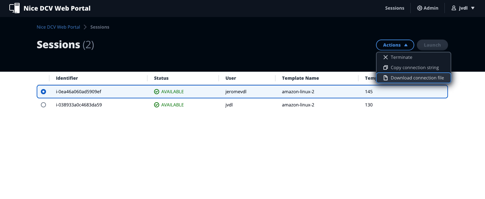
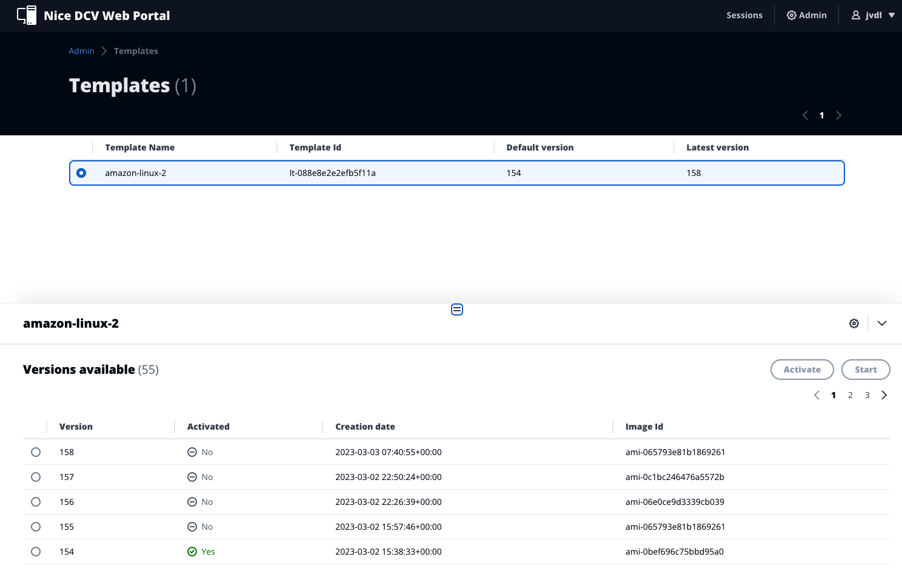

# Highly Customisable VDI Solution Web Portal

Current version: **0.2.0**

## 📋 Table of content

- [Description](#-description)
- [Screenshots](#-screenshots)
- [Deployment](#-deployment)
- [Usage](#-usage)
- [Information](#-information)
- [See Also](#-see-also)

## 🔰 Description

A web portal is provided in order to allow users and admins to handle and request workstations.

The user interface is built with [React](https://reactjs.org/) framework and is written in TypeScript language. It uses [Cloudscape](https://cloudscape.design/) UI styles and components. Authentication is done through Cognito and Amplify components.

## 🖥 Screenshots

### Sessions



### Templates (admin only)



## 🚀 Deployment

### Configuration

A configuration file (_src/config.js_) is required for the web portal to communicate with the backend. This configuration file is automatically generated by terraform at the end of the deployment (see the root [README](../README.md#all-in-one-deployment--option-1-)).

The config file contains the following entries:

| Entry                   | Description                                          | Example                                                                       |
|-------------------------|------------------------------------------------------|-------------------------------------------------------------------------------|
| `region`                | The region where the backend is deployed             | "eu-west-1"                                                                   |
| `userPoolId`            | The Cognito User Pool Id used for authentication     | "eu-west-1_c5pAF4LfR"                                                         |
| `userPoolWebClientId`   | The Cognito Application Id used for authentication   | "2nv4kh26q1bau61tsd9a0pjk3m"                                                  |
| `identityPoolId`        | The Cognito Identity Pool Id used for authentication | "eu-west-1:e4cb6e49-adb0-4a7f-a46e-28de1ca52d6e"                              |
| `apiEndpoint `          | The URL of the REST API                              | "https://a1b2c3d4e5.execute-api.eu-west-1.amazonaws.com/prod"                 |
| `gatewayEndpoint`       | The URL of the connection gateway (NLB)              | "https://workspaces-dev-gateway-00e64b157b7137ad.elb.eu-west-1.amazonaws.com" |
| `defaultLaunchTemplate` | The name of the Launch Template to use               | "amazon-linux-2"                                                              |

### Deployment

You can use the [deploy.sh](deploy.sh) script. Ensure the script is executable (`chmod +x deploy.sh`) and run the following command.
Please make sure to replace _frontend_bucket_ and _frontend_distribution_id_ with the appropriate values (you can get them in the outputs from terraform, running `terraform output` in the terraform folder).
```bash
$ ./deploy.sh -s frontend_bucket -d frontend_distribution_id
```
The script will build the application with `npm` and copy all the generated files to S3. It will also invalidate the CloudFront distribution, which can take a moment to finish.

## 📌 Usage

### Sessions
A session is the association of a user and an instance. When users access the portal, this is the default page.
Users can then start a new session by pressing the *Launch* button. 
Once the session is started (marked as AVAILABLE), users can then:
 - Terminate the session (it will terminate the corresponding instance).
 - Get the connection string to copy in the NICE DCV Client.
 - Download a connection file that will start the NICE DCV Client.

### Templates (admin)
In the templates screen, admins can see available templates and versions. 
They can either set a specific version as the default one (by pressing *Activate* button), for example if a new version has an issue, they can rollback to a previous one.
Or they can start instances with a specific version (using the *Start* button). These instances are not yet associated to any user, but will be used when a user want to start a session.

## 📊 Information

The below information displays approximate values associated with deploying and using this stack.

| Metric              | Value        |
|---------------------|--------------|
| **Deployment Time** | 5-10 minutes |

## 👀 See Also

- The [License](LICENSE) of the project.

